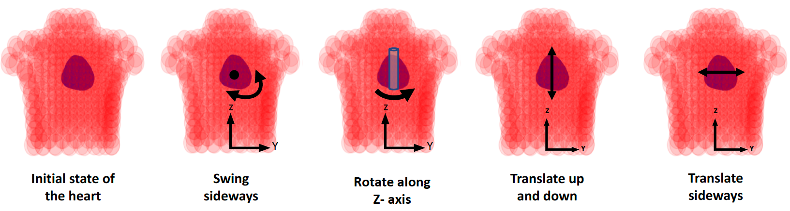

# SimECG dataset

SimECG dataset is the 12-lead ECG data set with a controlled set of generative factors involving the geometry of the heart and torso. The original paper will be available soon [paper](https://github.com/Prasanna1991/SimECG).

<p align="center">
  
</p>

Please download the dataset from this [link](https://drive.google.com/drive/folders/1OTQjuj1IGABgQHeSfSNOaB67myXzbyJK?usp=sharing) and save them in the corresponding folder.

## SimECG:
- Separated into three files [243 hearts divided into three groups, for efficient file arrangement based on "Swing along X-axis".]
    - 0-242 ==> allData_242.pth (Swing along X-axis = -10 degree)
     - 243-485 ==> allData_485.pth (Swing along X-axis = 0 degree)
     - 486-728 ==> allData_728.pth (Swing along X-axis = 10 degree)
- Each file has data_tensor and target_tensor. 
     - data_tensor: signals which represent 12-lead ECG signals arranged sequentially. Each signal has a length of 2952 which is [12x246], meaning each lead's length is 246. 
     - target_tensor: labels that represent both the labels for the signals and the anatomical variations of the heart. Ten labels in total:
         1. Swing along X-axis [since we split the file based on this factor, this will have same value for any .pth file.]
         2. Swing along Y-axis [-10, 0, 10]
         3. Swing along Z-axis [-20, 0, 20]
         4. Translation along X-axis [-10, 0, 10]
         5. Translation along Y-axis [-5, 0, 5]
         6. Translation along Z-axis [-20, 0, 20]
         7. X-coordinate [X-, Y- and Z-coordinate in total would make 1665 unique pacing sites (location) in the heart.]
         8. Y-coordinate
         9. Z-coordinate
         10. Segment label [10 class]


## SimECG-torso:
- A single file allData.pth [81 hearts]
- Each file has data_tensor and target_tensor.
     - data_tensor: same as above.
     - target_tensor: 8 labels in total:
         1. Variation along torso [0.9, 1, 1.1]
         2. Translation along X-axis [-10, 0, 10]
         3. Translation along Y-axis [-5, 0, 5]
         4. Translation along Z-axis [-20, 0, 20]
         5. X-coordinate [X-, Y- and Z- total would make 1665 unique pacing sites (location) in the heart.]
         6. Y-coordinate
         7. Z-coordinate
         8. Segment label [10 class]


Along with the dataset, we are providing some sample scripts to load them. These scripts are based on [PyTorch](https://github.com/pytorch/pytorch). Note that this is just one example, and one can use a different style to load these datasets.
- SimulatedDatasets.py gives an example of the data loader.
- test.py loads the data using SimulatedDatasets.py. 

If you find this dataset useful, please cite it as follows:

### Bibtex (will be updated soon)
```
@inproceedings{gyawali2021learning,
  title={Learning to Disentangle Inter-subject Anatomical Variations in Electrocardiographic Data},
  author={Gyawali, Prashnna Kumar and Murkute, Jaideep Vitthal and Toloubidokhti, Maryam and Jiang, Xiajun and Horacek, B Milan and Sapp, John L and Wang, Linwei},
  journal={IEEE Transactions on Biomedical Engineering},
  volume={},
  number={},
  pages={},
  year={2021},
  publisher={IEEE}
}
